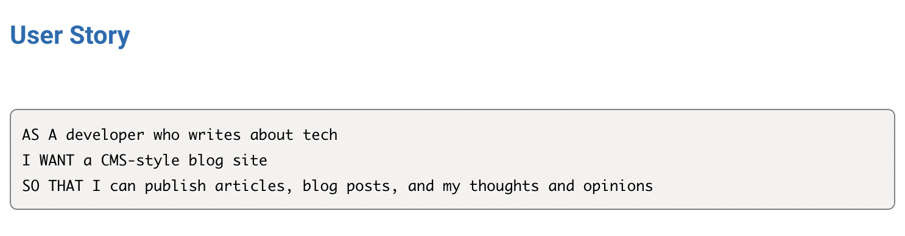
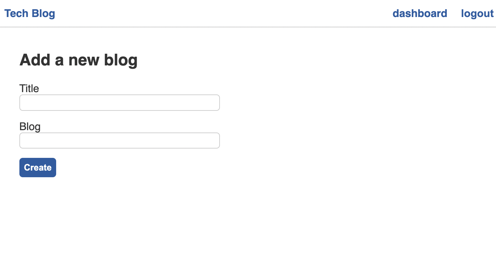
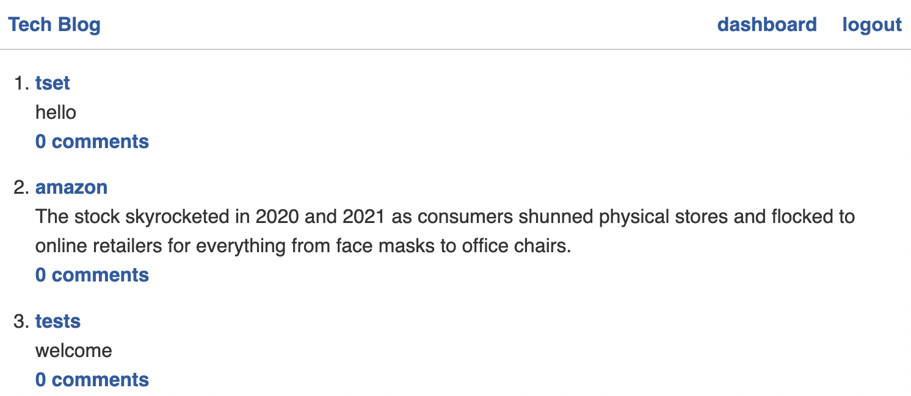

# tech-blog

## Description
This application was built so that developers can publish their blog posts and comment on other developers’ posts as well.

## User story 

## Usage 
* This application will allow users to:
    - Sing up
    - Post blogs
    - Create a comment
    - Edit a post 
    - Delete a post

## Screenshots

## Technologies Used

<a href="https://www.npmjs.com/package/express-handlebars">Express-Handlebars</a>

<a href="https://www.npmjs.com/package/mysql2">Mysql2</a>

<a href="https://www.npmjs.com/package/sequelize">Sequelize</a>

<a href="https://www.npmjs.com/package/dotenv">dotenv</a>

<a href="https://www.npmjs.com/package/bcrypt">bcrypt</a>

<a href="https://www.npmjs.com/package/express-session">Express-Session</a>

<a href="https://www.npmjs.com/package/connect-session-sequelize">connect-session-sequelize
</a>

## Live link 

<a href="https://shielded-shore-97774.herokuapp.com"> Live link</a>

